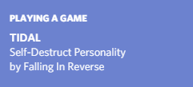

# TIDAL & Discord Rich Presence

I made this because I get TIDAL for free, so I why would I pay for Spotify? For that shiny Discord integration? I DON'T **THANK** SO.

## Requirements

- TIDAL must be installed as a Windows application. The current playing song gets read from the window title of "TIDAL.exe".
- Discord must be running.
- I don't know what will happen if you have this running while you're playing an actual game

## How To

I'm not going to put an executable on here for now. You will need the Go SDK for Windows. Building an executable yourself is pretty easy.

* `git clone https://github.com/usrbinsam/discord-tidal-rich-presence.git`
* `cd discord-tidal-rich-presence`
* `go build .\src`
* `set CLIENT_ID=yourClientID`
* `src.exe`

## Screenshot

